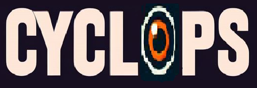

<>
<h1 align="center">CYCLOPS</h1>

An open-source desktop assistant bot working on Large Language Model locally.

Video Demonstration and Explanation:

### About
Our main aim for this bot was to run and integrate the quantized llm models locally instead of using an API. Moreover many functionalities like speech recognition 
is also being run locally.

### Features
The following are the features that are available for this release:
1) **Idleness Remainder -** By default after 30 minutes the bot will give a reminder to get up and stretch.
2) **Emotion Detection -** By default after 2 hours the bot will analyze your emotions and also check if you are drowsy and perform the necessary actions to wake you up.
3) **User Presence -** By default after two minutes the bot will check if you are present in front of the computer. If user is not detected it will lock the system automatically.
4) **News -** Scrapes the relevant websites and reads the headlines at the first boot each day.
5) **Note Maker -** Create notes and read the previous notes.
6) **Scheduler -** Creates and reminds you of your schedules like meetings or reminders.
7) **Curent Time and Date reading**
8) **Play Music -** Plays music based on four youtube playlists i.e classical, pop, techno and rock.
9) **Camera -** Opens the custom camera and takes a picture either manually or by command.
10) **Play Games -** At present it can play 2 games one is rock-paper-scissors using camera and other game is hangman.
11) **Image showing -** Can show images scrapped from the website if LLM want to show it.
12) **Youtube Player -** Based on LLM command can access and play a video on a particular topic.
13) **Timer -** Sets a timer for a particular amount of time with a custom message for the timer.

### Some Hard Coded Commands
Some functionalities have been hard coded to improve execution speed and quality, these are:
1) **Cyclops -** The wake up word for the bot.
2) **What/Whats/What's the time -** To tell the current time.
3) **What/Whats/What's the date -** To tell the current date.
4) **Play classical/pop/techno/rock music -** To play the respective playlist in the YouTube.
5) **Let's play a game/ Play games -** To play games either hangman or rock-paper-scissors.
6) **How do I look -** To open the camera module.
7) **Note engine/noting engine -** To begin the noting process.
8) **Click a picture/take a picture -** To take a picture and save it in the photos taken folder.
9) **What/Whats/What's the room temperature -** Shows the room temperature and humidity using the DHT11 sensor.
10) **Typing mode -** To take inputs and prompts using keyboard.
11)** Audio mode -** To take inputs using mic or speech-to-text.
12)** Shutdown/shut down -** To close all engines and terminate the program.

### How to use it
Check this Instructables link to find out how to make your own physical bot and interface it with the software.
Link :

### A few keypoints
1) This software and hardware has been tested and created on Windows 11 and Python 3.10
2) Browser path has to be changed according to the location of the browser you are using.
3) Do not change the file structure or names.
4) Make sure you have atleast 8 gb of RAM in your system.
5) Some webscrapping scripts might become obsolete by the time you start making your own bot.
6) Download the files from the following google drive link because llm models are too large and we were unable to add emotion recognition models as well.
Link: https://drive.google.com/drive/folders/1X-ubLckjLJAn6dmfQuTygzYcOE_vS-ME?usp=sharing
7) You can also 3d print the parts using the .stl files provided in the 3D Printing folder.

## MIT License with Attribution

Copyright (c) [2024] [Mandred Tech]

Permission is hereby granted, free of charge, to any person obtaining a copy of this software and associated documentation files (the "Software"), to deal in the Software without restriction, including without limitation the rights to use, copy, modify, merge, publish, distribute, sublicense, and/or sell copies of the Software, and to permit persons to whom the Software is furnished to do so, subject to the following conditions:

The above copyright notice and this permission notice shall be included in all copies or substantial portions of the Software.

**Attribution Clause:**
Users of this software are required to include an attribution to Mandred Tech in any publication, distribution, or derivative works based on this software.

THE SOFTWARE IS PROVIDED "AS IS", WITHOUT WARRANTY OF ANY KIND, EXPRESS OR IMPLIED, INCLUDING BUT NOT LIMITED TO THE WARRANTIES OF MERCHANTABILITY, FITNESS FOR A PARTICULAR PURPOSE AND NONINFRINGEMENT. IN NO EVENT SHALL THE AUTHORS OR COPYRIGHT HOLDERS BE LIABLE FOR ANY CLAIM, DAMAGES OR OTHER LIABILITY, WHETHER IN AN ACTION OF CONTRACT, TORT OR OTHERWISE, ARISING FROM, OUT OF OR IN CONNECTION WITH THE SOFTWARE OR THE USE OR OTHER DEALINGS IN THE SOFTWARE.

